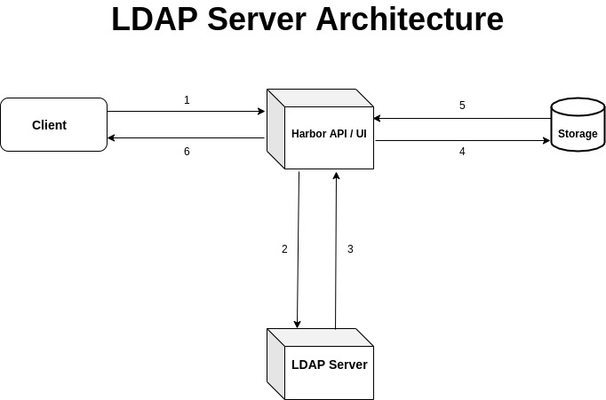

# Set up an LDAP server and integrate the authentication of Harbor registry

### LDAP Server Architecture

### Steps: 

1. Client login request to Harbor UI/ API
2. Check LDAP authentication credentials with LDAP/AD server
3. LDAP/AD response with success/failure
    i. If authentication fails, go to step 6
    ii. If authentication succeeds, go to step 4
4. Request required data for authentication process from database (ACL,Roles)
5. Response with the required data
6. Response to client 
    i. If authentication fails, login failed
    ii. If authentication succeeds, login successful

Steps to set up the LDAP server : 

1. Update the system and install the required packages for centOS 

  $ yum update && yum -y install openldap compat-openldap openldap-clients openldap-servers openldap-servers-sql openldap-devel

2. Start the LDAP Daemon and enable it on boot

  $ systemctl start slapd.service
  $ systemctl enable slapd.service
  
3. Run slappasswd to set up LDAP root password and save the output to 
   configure further.
   
  $ slappasswd

4. We use LDIF files to configure the server with the ldapmodify command. 
   Stores the files in ‘/etc/openldap/slapd.d’
   Fill in the domain and the created root password in a hashed form.
   
  $ ldapmodify -Y EXTERNAL -H ldapi:/// -f db.ldif
  
5. Restrict monitor access to only the admin user
  
  $ ldapmodify -Y EXTERNAL -H ldapi:/// -f monitor.ldif
  
6. Create self signed certificate and key to communicate with LDAP server.
  
  $ openssl req -new -x509 -nodes -out \
    /etc/openldap/certs/myldap.<hostname>.cert \
    -keyout /etc/openldap/certs/myldap.<hostname>.key \
    -days 365

7. Change owner and group permissions so OpenLDAP can modify/read files

  $ chown -R ldap:ldap /etc/openldap/certs

8. Configure OpenLDAP to use the LDAPS protocol

  $ ldapmodify -Y EXTERNAL -H ldapi:/// -f certs.ldif
 
9. test your configuration with a slaptest 

  $ slaptest -u
 
10. Set up OpenLDAP database with sample config 

  $ cp /usr/share/openldap-servers/DB_CONFIG.example /var/lib/ldap/DB_CONFIG
  $ chown -R ldap:ldap /var/lib/ldap
  
11. Add LDAP schemas 

  $ ldapadd -Y EXTERNAL -H ldapi:/// -f /etc/openldap/schema/cosine.ldif
  
12. Create the base.ldif file for your domain with relevant groups and users.

  $ ldapadd -x -W -D "cn=ldapadm,dc=<hostname>,dc=<hostname>,dc=com" -f base.ldif

  Enter the root password when prompted
