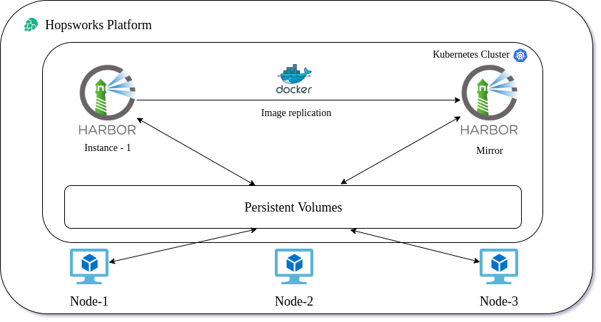

# Persistent Volumes and Persistent Volume Claims with Kubernetes Node's local-disk Storage

### Host filesystem storage with local storage class, persistent volumes and persistent volume claims

The Kubernetes node consists of a host filesystem as part of its operating system.
We create storage classes on these host filesystems by providing paths on the node
and deploying persistent volumes for these storage classes.
Further the applications use persistent volume claims to use the persistent volumes 
and store the application data on the host filesystem as persistent storage. This 
helps to persist the data upon Kubernetes pods lifecycle. 

### Harbor Architecture with local Storage on Kubernetes Nodes

 The above architecture consists of a 3-Node Kubernetes Hopsworks Cluster. 
 The three nodes represented in the form of VM's consists of a host operating system with
 a filesystem each. It consists of two instances of the Harbor container registry hosted 
 on the kubernetes cluster with persistent volume claims for both these instances binding
 with persistent volumes set up on thier local storage respectively. 
 Hence Harbor-1 instance will store all its data on Node-1 and with an automated replication
 rule in place, the images that are pushed to this registry are automatically copied to Harbor-2 
 instance which in turn stores these on it's (Node-3) local storage using persistent volumes. 
 Hence all the images pushed to Harbor-1 instance will have its manifests stored on Node-1 
 local storage as well as Node-3 local storage. 
 Although it does not provide High Availibility in terms of cluster failure, it provides 
 redundancy in the form of duplications in the case of node failures. 
 Steps to set up are as follows.
 
 
 1) Set up the Storage class on the kubernetes cluster.
    
    $ kubectl apply -f storageClass.yml
    
 2) Create namespaces for hosting two harbor container registry instances 
    
    $ kubectl create ns harbor-1 
    
    $ kubectl create ns harbor-2
    
 3) Create the Persistent Volumes for these instances in different namespaces
    
    $ kubectl apply -f harbor1-PersistentVolume.yml -n harbor-1
    
    $ kubectl apply -f harbor2-PersistentVolume.yml -n harbor-2
    
    Make sure the persistent volumes points towards volumepaths on Node-1 and 
    Node-3 respectively
    
 4) Create the persistent volume claims for both instances of harbor in thier 
    respective namespaces
    
    $ kubectl apply -f harbor1-PersistentVolumeClaim.yml -n harbor-1
    
    $ kubectl apply -f harbor2-PersistentVolumeClaim.yml -n harbor-2
    
 5) Deploy the two instances of Harbor Container registry in respective namespaces
    using the existing claims as means of persistent storage for each instances.
