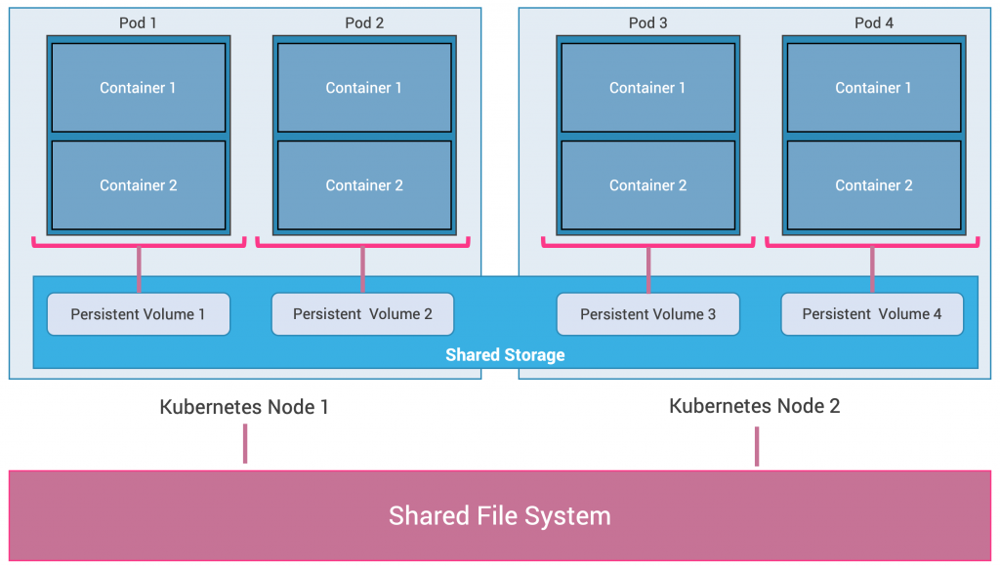
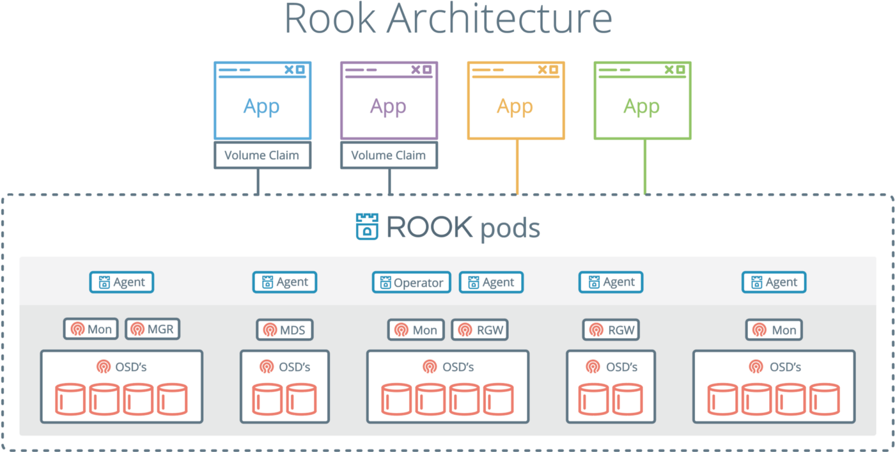
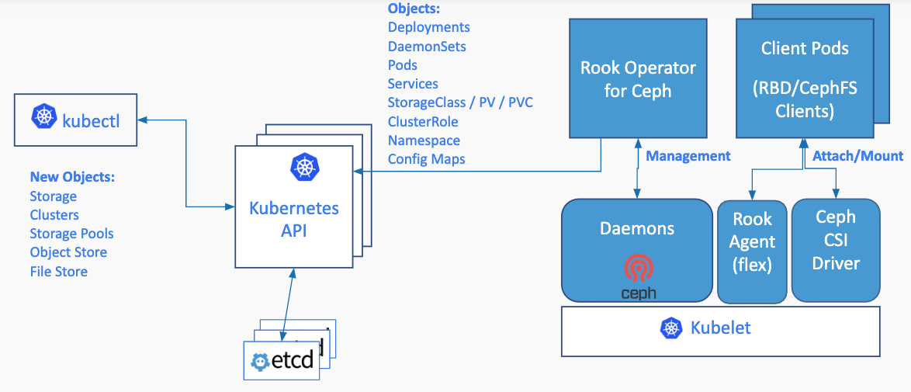

 # Deploying a Ceph cluster on Kubernetes with a Rook Operator
                                
 ### Shared Filesystem Architecture on Kubernetes                           
                            
   
   
   
   
      Above represents a shared filesystem architecture which allows the pods in the kubernetes cluster 
      to use a persistent volume claim to access a persistent volume that acts as a shared storage 
      resource in the kubernetes cluster across the nodes. 
      This shared storage in the form of persistent volumes is itself built on top of a distributed filesystem 
      hosted on the kubernetes nodes by using the disk storage of each of the nodes storing the data over 
      the network with replicas (HA feature provided by DFS).
      For the harbor instance to be hosted on the kubernetes cluster, 
      we create a Ceph distributed filesystem cluster on the kubernetes cluster and create persistent volumes 
      for the pods in them using a Rook operator.  
   
   
   
   
  ### Rook with Ceph Design 
   
   
                            
                            
      Rook is a smart operator that enables Ceph storage systems to run on Kubernetes using Kubernetes primitives.
      The Rook pods as shown in the architecture above provides application pods to claim a volume by accessing thier pods.
      The Rook pods consist primarily of an Agent, Monitor, Manager and Object storage Daemons with these pods taking care
      of the Ceph cluster states, metrics and storing the application data in the provided location using the daemons.
      Hence with Ceph running in the Kubernetes cluster, Kubernetes applications can mount block devices and filesystems managed by Rook. Necessary steps to build the stack is as follows:
       
       1) Update Kubernetes cluster to v1.13+
       
       Follow the below link for updation without downtime. (Update Docker with the help of Docker_upgrade.txt)
            https://kubernetes.io/docs/tasks/administer-cluster/kubeadm/kubeadm-upgrade/
       
       2) Clone the GitHub Repository
       
          $ git clone https://github.com/rook/rook.git
          $ cd rook
          $ git checkout release-1.0 (All yaml files are configured based on this version)
          
       3) Create CRD's for communication with the API Server. Inside cluster/examples/kubernetes/ceph switch the common.yaml file with the one in this repo.
          $ kubectl apply -f common.yaml (creates service account,role,role binding and cluster role)
          
       4) Once the roles are set up, create the Rook operator responsible for the orchestrationof the Ceph Cluster.
       
         $ kubectl apply -f operator-with-csi.yaml (switch file with operator.yaml in the original repo)
       
       5) This operator also triggers the creation of DaemonSet in charge of deploying a rook agent on each worker node in the kubernetes cluster.
       
       6) Create a Ceph Cluster with mgr as a Manager daemon keeping track of metrics and state of Ceph cluster (HA requires 2 mgr)
       - mon is Monitor maintains maps of cluster states required for the daemons to coordinate with each other. (HA requires atleast 3)
       - osd is the Object storage daemon responsible to store data and corresponding replication,recovery etc. (HA requires atleast 3 osd)
       - uses all nodes to persist data of the ceph cluster.
       
         $ kubectl apply -f cluster.yaml
         
       7) Format  a /dev/<location> to xfs format in the local system for usage. Use and deploy the storage class which defines a Replica pool and storage class to create a persistent Volume backed by Ceph block storage.
        
         $ kubectl apply -f storageclass.yaml
         
       8) Persistent Volume and Persistent Volume Claim are created inside the required Namespace with the files persistentVolumeRook.yml and persistentVolumeClaimRook.yml
       
        $ kubectl apply -f persistentVolumeRook.yml 
        $ kubectl apply -f persistentVolumeClaimRook.yml
        
       9) Deploy the Harbor application to use the created PVC harbor-claim2 to use the storage on the cluster on a distributed storage.
       
       
                                                    
                                                    
                                                    

